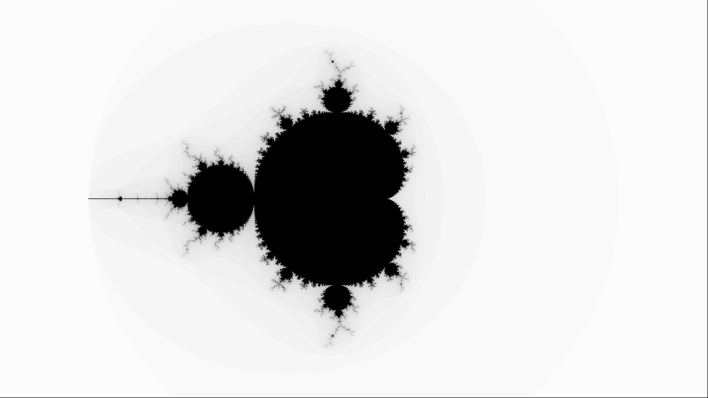
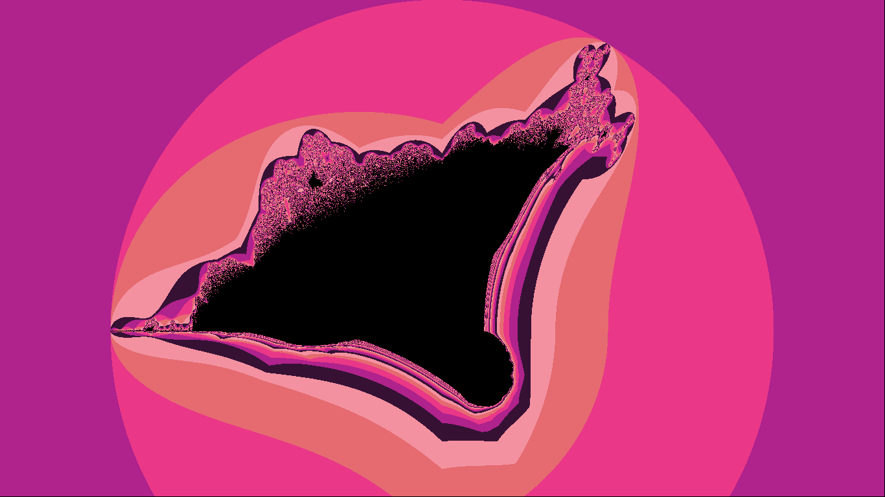
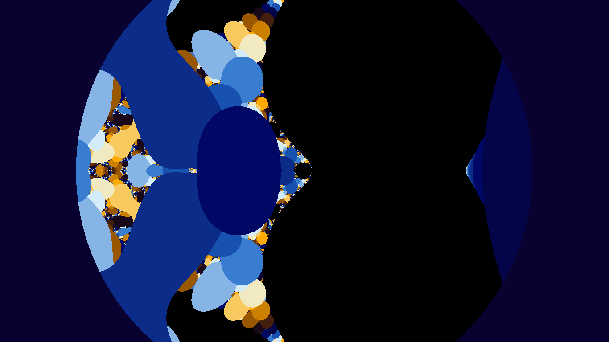

# Pygame-Fractals
A python scrit that uses pygame to display interactive fractals.
There are 3 fractals on the script. They can be displayed on the colors gray, blue, pink.
You can walk and zoom on the fractals.

# Mandelbrot Set

# Burning Ship

# Other

# Installation
The following modules are required:
- pygame
- numba

Just type:

    git clone https://github.com/mlchelCar/pygame-fractals.git
    cd pygame-fractals
    pip3 install requirements.txt -r

# Usage
- Escape key:
  quit
- Up key:
  move up
- Down key:
  move down
- Left key:
  move left
- Right key:
  move right
- Shift key:
  zoom in
- Ctrl key:
  zoom out
- Space key:
  refresh
